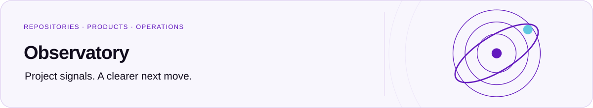

  <a href="../../README.md">
    <picture>
      <source media="(prefers-color-scheme: dark)" srcset="../../docs/assets/readme/workspace-dark.svg">
      
    </picture>
  </a>

<h1 align="center">API</h1>

  
  

  <a href="../../README.md">Project overview</a> ·
  <a href="package.json">Package manifest</a> ·
  <a href="#resources">Resources</a>

**On this page:** [Responsibility](#responsibility) · [Workspace commands](#workspace-commands) · [Resources](#resources)

Authentication, collection, and feedback operations for Observatory.

## Responsibility

The Hono Worker owns authentication, provider access, scheduled collection, and writes.
The web dashboard consumes this API rather than calling providers or D1 directly.
Public feedback routes remain project-scoped; owner data and private reports remain protected.

Follow the [root local setup](../../README.md#local-setup) before starting the Worker.
It covers development secrets, GitHub setup, and local migrations. Routes live in
[src/routes](src/routes), provider integrations in [src/lib](src/lib), and runtime types in
[src/env.ts](src/env.ts).

## Workspace commands

Run from the repository root after its documented setup. Use the Node.js and pnpm versions
declared in the root [package.json](../../package.json).

| Task                            | Command                                                   |
| ------------------------------- | --------------------------------------------------------- |
| Start local development         | `pnpm --filter @santi020k/observatory-api run dev`        |
| Build or compile this workspace | `pnpm --filter @santi020k/observatory-api run build`      |
| Lint this workspace             | `pnpm --filter @santi020k/observatory-api run lint`       |
| Check types                     | `pnpm --filter @santi020k/observatory-api run type-check` |
| Run workspace diagnostics       | `pnpm --filter @santi020k/observatory-api run check`      |
| Run workspace tests             | `pnpm --filter @santi020k/observatory-api run test`       |

## Resources

[Project overview](../../README.md) · [Contributing](../../CONTRIBUTING.md) · [License](../../LICENSE) · [Architecture](../../docs/architecture.md) · [Feedback platform](../../docs/feedback-platform.md) · [Private projects](../../docs/private-projects.md)
